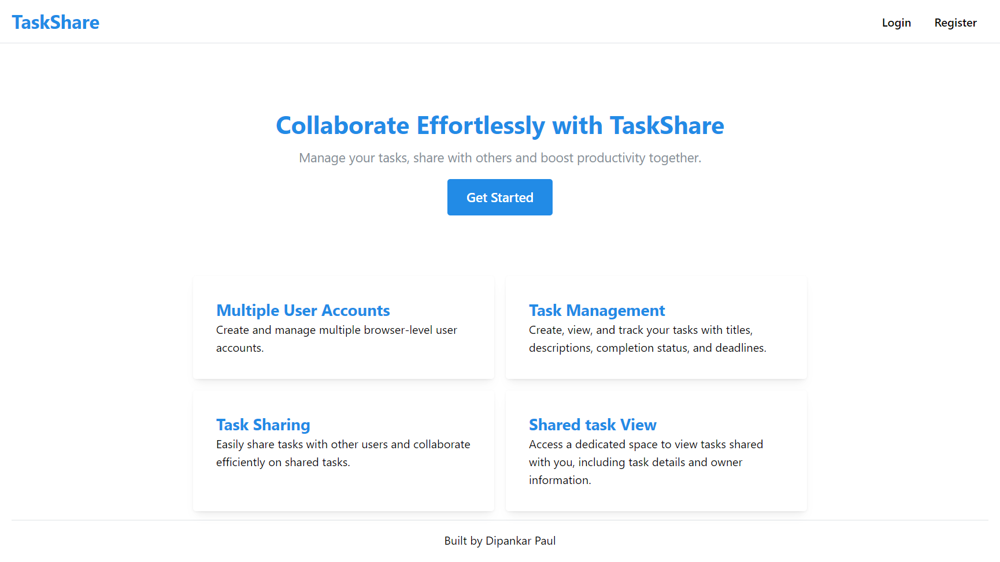
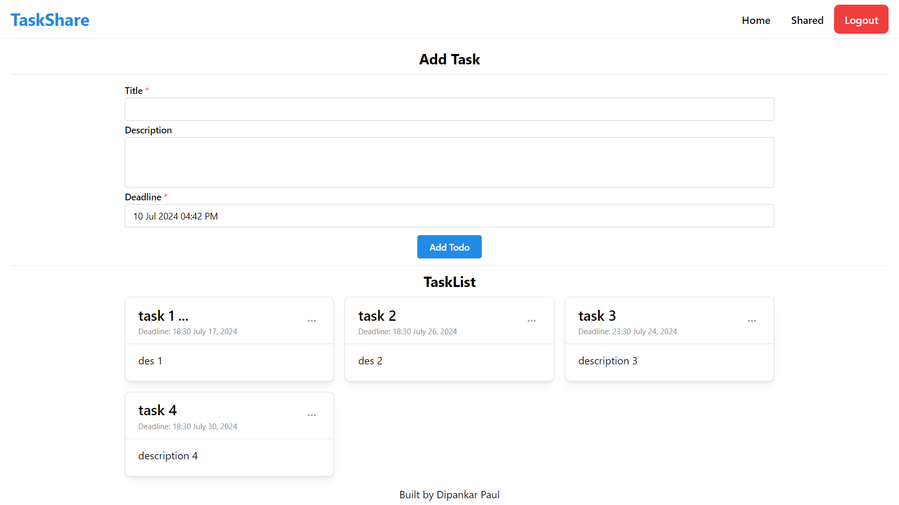
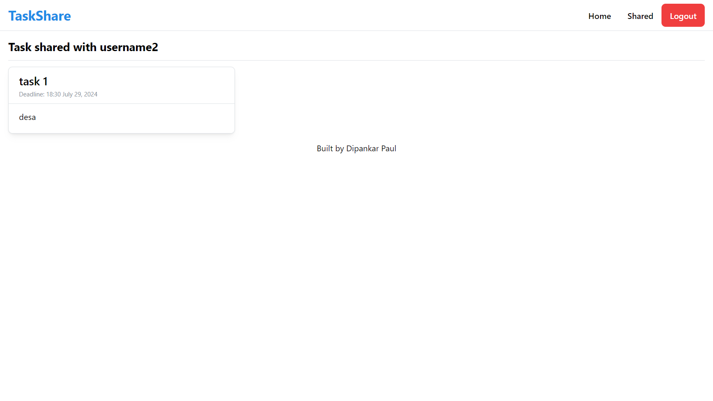
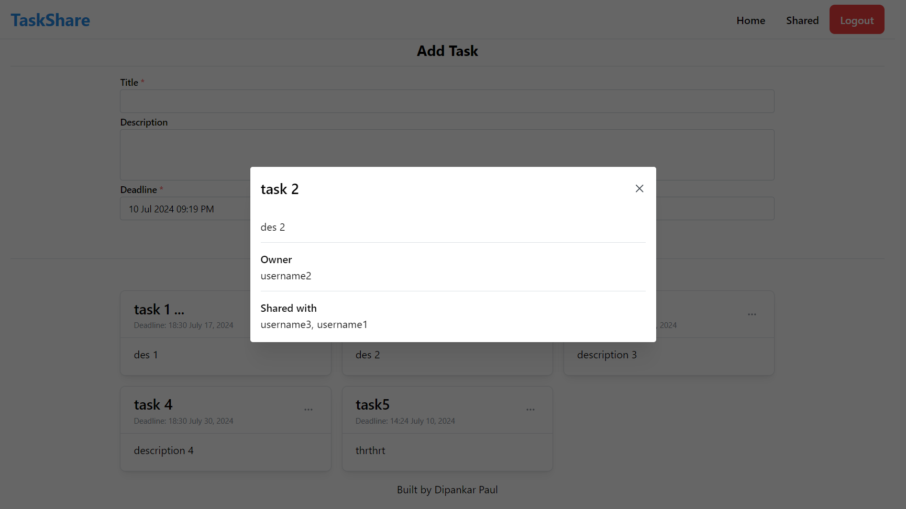
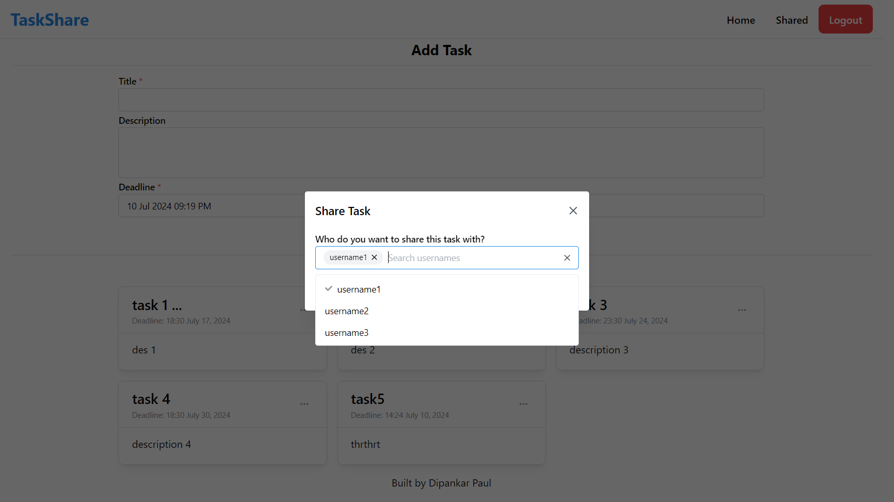
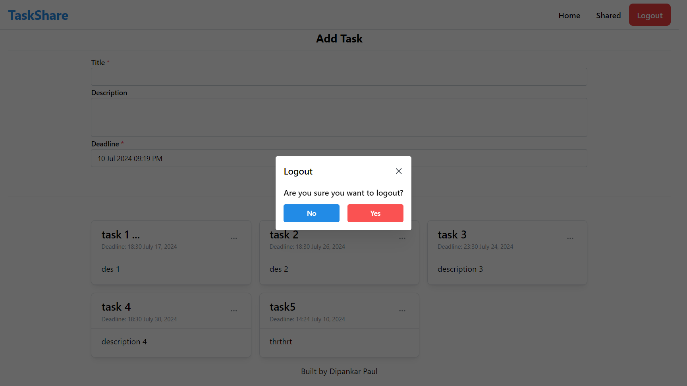

<!-- omit in toc -->
<h1 align="center">TaskShare</h1>

A simple task manager application built with MERN stack.



- [Installation](#installation)
- [Configuration](#configuration)
- [Run the App](#run-the-app)
- [Screenshots](#screenshots)

## Installation
Run the following command to clone the repository

```bash
git clone https://github.com/dipankarpaul2k/ELPIP-Internship-TaskShare-MERN-App.git
```

Go to frontend and backend directory to install packages

```bash
cd frontend
npm install
```

```bash
cd backend
npm install
```

## Configuration
Create `.env` file inside backend directory and copy the following code

```bash
MONGO_URI=Your mongodb URI
JWT_SECRET=a random secret key eg. thisisasecretkey
```

## Run the App
Go to backend and frontend directory and start the server

```bash
cd backend
npm run dev
```

```bash
cd frontend
npm run dev
```

## Screenshots











